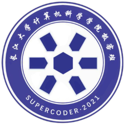
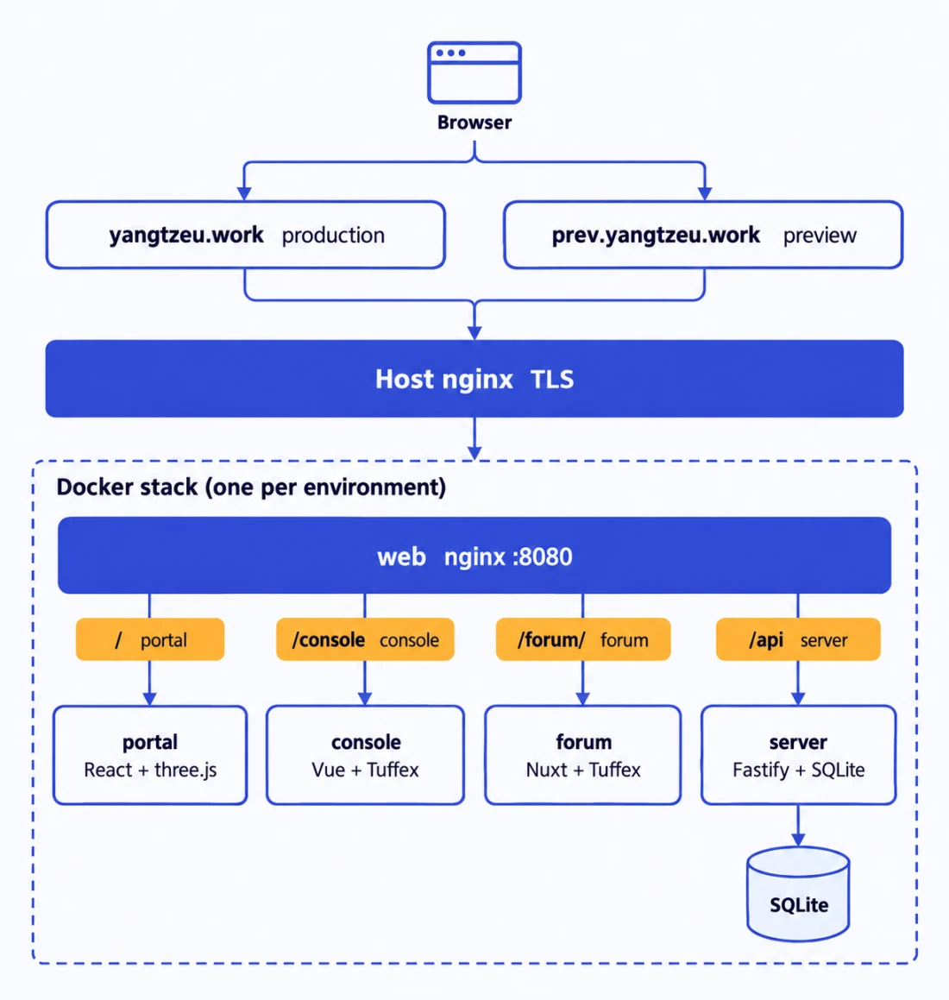

<div align="center">



# geek_main

### Portal, console, forum and server of the Yangtze University Geek Class, in one repository

<p>The portal is for visitors, the console is for the people who run the class, the forum is for discussion, and the server ties all three to the GitHub organization.</p>

<p>
  <a href="README.md"><b>中文</b></a>
  &nbsp;|&nbsp;
  <a href="README.en.md"><b>English</b></a>
</p>

<p>
  <a href="https://yangtzeu.work"><b>Production site</b></a>
  &nbsp;·&nbsp;
  <a href="#quick-start"><b>Quick start</b></a>
  &nbsp;·&nbsp;
  <a href="#branches-and-releases"><b>Branches and releases</b></a>
  &nbsp;·&nbsp;
  <a href="docs/README.md"><b>Docs map</b></a>
  &nbsp;·&nbsp;
  <a href="AGENTS.md"><b>Agent entry</b></a>
</p>

<sub>React + three.js · Vue + Tuffex · Nuxt · Fastify + SQLite · Docker · private repository</sub>

</div>

---

<div align="center">


</div>

---

This English page is an overview. The Chinese documents are canonical; when they disagree, follow [README.md](README.md) and [docs/](docs/README.md).

> [!IMPORTANT]
> **The forum has no real backend or authentication yet.** Locally it either shows a read-only archive of the old class forum (no login, no writes) or the upstream demo, whose identities are not GitHub logins and whose content lives only in the current browser. Unified internal authentication, service integration and the 3D Hub are not built. Do not describe this adoption as a finished production community.

## What is here

| Service | Directory | What it does | Stack | Contract |
|---|---|---|---|---|
| Portal | `app/web` | 3D desk that boots into the YUGC OS desktop; join-us letter, forum and GitHub scenes, docs, feedback, invite landing | React 18 · Vite 6 · three.js 0.186 | [web](docs/services/web/README.md) |
| Console | `app/console` | GitHub sign-in; pages shown by title: applications, people and permissions, feedback, audit, GitHub org admin | Vue 3.5 · Tuffex 0.6 · Vite 7 | [console](docs/services/console/README.md) |
| Forum | `app/forum` | MIT-licensed Tuff Forum adopted as-is; can show a read-only snapshot of the old forum locally | Nuxt 4 · Tuffex 0.6 · Node >=26 · pnpm 11.24.0 | [forum](docs/services/forum/README.md) |
| Server | `app/server` | GitHub OAuth, sessions, invite links, applications, feedback, console API | Fastify 5 · better-sqlite3 · Node 22 | [server](docs/services/server/README.md) |

## Architecture

<div align="center">



</div>

One domain per environment, split by path: `/` portal, `/console` console (old `/admin` redirects there), `/forum/` forum, `/api` and `/auth` server. Only the `web` container publishes a host port; host nginx terminates TLS.

## Quick start

Core packages use Node 22 (at least 22.13) and pnpm 9.15.9. The forum needs Node >=26 and pnpm 11.24.0 and is driven only through the root `forum:*` scripts.

```bash
pnpm install --frozen-lockfile
pnpm dev:web        # portal with read-only mock data: http://127.0.0.1:5173/sites/portal/
pnpm dev:console    # console with sample data: http://127.0.0.1:5186/console
pnpm forum:install && pnpm forum:start   # forum: http://127.0.0.1:3456/
pnpm verify         # check + test + build, plus forum check/generate
pnpm test:e2e       # Playwright checks for portal and console
```

Type checks, builds, mock previews, browser checks and production acceptance are different kinds of evidence; one does not stand in for another. Never test against production data or credentials.

## Branches and releases

- Only `main` (production) and `stage` (preview) live long. `stage` must contain `main`; `main` only fast-forwards to commits already on `stage`.
- One piece of work = one issue = one `task/<issue>/<slug>` branch = one worktree = one PR into `stage`. Start with `node scripts/task.mjs start <issue> <slug>`. Branch names never use `-`.
- `dev/<github-username>` is personal scratch space: never deployed, never a way into `stage`.
- Pushing a branch deploys nothing. `vX.Y.Z-rc.N` on a `stage` commit deploys preview; after the owner accepts it there, `vX.Y.Z` on the same commit deploys production. Release tags need the owner's authorization and are never moved or deleted.

Rules: [BRANCHING](docs/conventions/BRANCHING.md) · [RELEASES](docs/conventions/RELEASES.md) · [CODE-REVIEW](docs/conventions/CODE-REVIEW.md).

## Deployment

Two isolated Docker stacks on one host behind host nginx: production at `/opt/yzgc/production` (`https://yangtzeu.work`, web on `127.0.0.1:18100`) and preview at `/opt/yzgc/preview` (`https://prev.yangtzeu.work`, web on `127.0.0.1:18200`). Images are per environment, `yzgc-production/{server,web,forum}:<sha12>` and `yzgc-preview/{server,web,forum}:<sha12>`. Environment files live only in `deploy/env/`, with secrets left blank. Deployment switches default to off. See [DEPLOY](docs/ops/DEPLOY.en.md) and [CICD](docs/ops/CICD.md).

## License

Private project. The adopted [Tuff Forum](https://github.com/talex-touch/tuff-forum) keeps its copyright and MIT license in [app/forum/LICENSE](app/forum/LICENSE). README images were generated with crosery-ct `mox_image_generate`.
