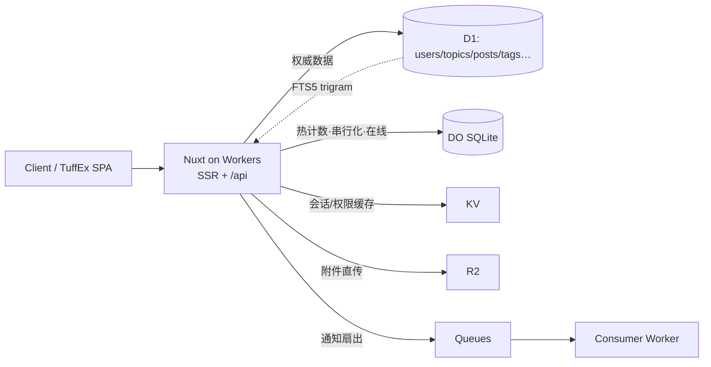

# PRD-0001 · Tuff Forum Cloudflare 边缘化

| 项 | 值 |
|---|---|
| 状态 | **Draft**（待评审，未开工） |
| 日期 | 2026-09-12 |
| 决策 | 采用 **Workers + D1 + Durable Objects(SQLite) + R2 + Queues** 单栈边缘方案；不引入自建常驻后端 |
| 影响面 | 新增 `server/` 层、D1 schema、鉴权与反滥用、构建部署链（Nitro `cloudflare_module`） |
| 证据 | Cloudflare 官方文档，抓取于 2026-09-12；页面自身标注 last updated 2026-04-21 / 2026-06-01 / 2026-08-28（见附录 B） |

---

## 1. 背景与问题

现状（`README.md`、`nuxt.config.ts`）：本仓是 **纯前端 mock** —— `ssr: false` 的 SPA，全部状态在 `app/stores/forum.ts` 的单个 Pinia store 里，经 `app/data/persist.ts` 落在 `localStorage`；seed 由确定性 PRNG 生成（48 话题 / 221 帖 / 12 用户）。README 明确写着 "No backend, no real auth, no cross-device persistence — this is the shape of a forum, not a forum."

要把它变成真论坛，绕不开**"后端放哪"这一个决策**。自建 Node + Postgres 要承担常驻进程、补丁、备份、容量、DDoS 防护；而目标形态是轻量社区。因此本 PRD 先定选型与边界，再谈实现。

**待回答的问题**：这类轻量论坛能不能只靠 Cloudflare 边缘（Workers + 其存储原语）跑起来，代价是什么，什么时候必须退出。

---

## 2. 目标与非目标

### 目标（可验收）

| | 目标 | 验收方式 |
|---|---|---|
| G1 | 全部 14 条路由由边缘 SSR 渲染真实数据，不再是 `localStorage` mock | 现有 CDP 验收套件（`scripts/verify-*.mjs`）打到远程 URL 全绿 |
| G2 | 跨设备持久化：换浏览器/设备看到同一份内容 | 两次独立浏览器会话写入同一主题并互相可见 |
| G3 | 计数（回复/点赞/关注/浏览）在并发下不漂移 | 并发写测试：期望值 == 实测值 |
| G4 | 中文全文检索可用（≥3 字词、话题+帖文） | 固定召回用例表全通过 |
| G5 | 单次部署即可上线：无自有服务器、无容器编排 | `wrangler deploy` 一条命令出可访问 URL；回滚走版本回退 |

### 非目标（本期不做）

- N1 私信 / 徽章 / 信任等级 / 邮件通知（沿用 README 的非目标清单）。
- N2 管理后台独立应用、插件市场、主题模板。
- N3 实时推送（WebSocket）。DO 支持，但排在 M4 之后。
- N4 自建 Postgres/Redis。**这是退出路径，不是起点。**
- N5 多租户 / 多库分片。单库 10 GB 内不做分片。

---

## 3. 平台事实基线

> 结论先行：**能跑**。约束集中在三条：SQLite 事务边界、单库单线程、免费档按行计费。

### 3.1 Workers 运行时

| 项 | Free | Paid |
|---|---|---|
| 请求 | 100,000/日 | 10,000,000/月含，超出 \$0.30/百万 |
| CPU 时间/请求 | 10 ms | 默认 30 s，可调至 5 min；30,000,000 CPU-ms/月含 |
| 内存/isolate | 128 MB | 128 MB |
| 子请求 | 50/请求 | 10,000（可调至 10M） |
| 同时外出连接 | 6 | 6 |
| 启动时间 | 1 s | 1 s |
| 静态资源请求 | 免费且不限量 | 免费且不限量 |
| 最小月费 | \$0 | **\$5** |

要点：CPU 只统计执行时间，等待 `fetch`/D1 **不计入**；HTTP Worker 无 wall-clock 硬上限，`ctx.waitUntil()` 可在响应后延长 ≤30 s。

### 3.2 D1

| 项 | 限制 |
|---|---|
| 单库最大 | **10 GB**（Paid）/ 500 MB（Free）；官方明确"10 GB 不可再申请提升" |
| 账号库数 | 50,000（Paid）/ 10（Free） |
| 账号总存储 | 1 TB（Paid）/ 5 GB（Free） |
| 单行/单字符串/BLOB | 2 MB |
| 单 SQL 语句 | 100 KB；绑定参数 ≤100；单表列 ≤100 |
| `LIKE`/`GLOB` 模式长度 | **50 字节** |
| 单查询时长 | 30 s |
| 每次 Worker 调用查询数 | 1,000（Paid）/ 50（Free）；同时连接 ≤6 |
| 并发 | 单库**单线程**，1 ms/查询 ≈ 1,000 qps；队列满返回 `overloaded` |
| 事务 | 单语句自动提交；`db.batch()` 为隐式事务；**无交互式长事务** |
| 全文检索 | 支持 FTS5 虚拟表（含 `trigram` tokenizer） |
| 计费 | 行读 5M/日（Free）/ 25B 每月含（Paid）+\$0.001/M；行写 100k/日（Free）/ 50M 含 +\$1.00/M；存储 \$0.75/GB·月 |

三个直接后果：
1. **`COUNT(*)` 与 `OFFSET` 分页按扫描行计费** → 计数必须落列、分页必须 keyset。
2. **索引会额外计一次行写**（表行 + 索引行）。
3. **读复制**（read replication）按 `rows_read` 同价计费，可降低跨区读延迟。

### 3.3 Durable Objects（SQLite 后端，GA）

| 项 | 限制 |
|---|---|
| 单对象存储 | **10 GB** |
| 账号存储 | 不限（Paid）/ 5 GB（Free） |
| 每对象 | 单线程串行执行 → 天然互斥 |
| SQL 限制 | 与 D1 同（列 100、行不限、行/串 2 MB、SQL 100 KB、参数 100、LIKE 50 字节） |
| WebSocket 消息 | 32 MiB（接收） |

### 3.4 KV / Queues

| | 限制 |
|---|---|
| KV | 读 100k/日（Free）；**同一 key 写 1 次/秒**；值 25 MiB；`cacheTtl` 最小 30 s；最终一致 |
| Queues | Free **10,000 ops/日**（≈3,300 条消息，1 消息 = write+read+delete 3 ops）；Paid 1M ops/月含 +\$0.40/M |

**KV 同 key 1 写/秒** 决定了它不能放计数、不能放会话吊销列表；**Queues Free 10k ops/日** 决定了通知扇出必须合并批量，不能每帖每赞一条。

---

## 4. 架构决策

### AD-1 单栈边缘 vs 自建 vs 静态 + 第三方 BaaS

| 维度 | Workers 单栈（选定） | 自建 Node+Postgres | 静态 + BaaS |
|---|---|---|---|
| 运维 | 无服务器、无补丁、版本即回滚 | 常驻进程 + 备份 + 证书 + WAF | 无 |
| 冷启动 | isolate，无容器冷启 | 视部署而定 | 无 |
| 全局延迟 | SSR 就近执行 + D1 读复制 | 单区 | 视 BaaS |
| 一致性 | SQLite 事务边界，跨请求无长事务 | 完整 SQL/RDBMS 语义 | 视产品 |
| 月成本（小站） | \$0 → \$5 | ≥ \$15 + 运维人力 | \$0 → \$25 |
| 退出成本 | 低（SQL 方言接近 SQLite/Postgres 子集） | 迁移即重写 | 中（数据导出 + 重写 API） |

**决策**：选 Workers 单栈。理由：目标形态轻量、写路径单一、无跨实体强一致需求；运维成本可归零是决定性因素。

### AD-2 存储职责切分



- **D1 = 唯一权威**（single source of truth）。
- **DO = 只做需要串行化的状态**：浏览数、在线状态、编辑锁、限流令牌桶。不复制业务数据。
- **KV = 只做可丢的缓存**（权限快照、列表页片段），不参与正确性。
- **R2 = 附件**（头像、图片），零出口费。
- **Queues = 异步扇出**（@提及、关注者通知、审核任务）。

### AD-3 部署形态

Nitro `preset: 'cloudflare_module'` + **Workers Assets**，绑定写在 `wrangler.jsonc`（`d1_databases` / `durable_objects` / `kv_namespaces` / `r2_buckets` / `queues`）。不用 Pages：Workers + Assets 是官方 Nuxt 指南路径，且静态资源请求免费不限量。

### 被否方案

| 方案 | 否决理由 |
|---|---|
| Workers + Hyperdrive + Postgres | 起点过度：为轻量社区引入常驻数据库账单与运维；保留为 **§10 退出路径** |
| Workers + 纯 KV 存储 | KV 同 key 1 写/秒 + 最终一致，无法承载帖/赞/计数 |
| Workers + D1 但每帖一个 DO | DO 用于行级实体是过度设计；D1 足够，DO 只留给热态 |
| 维持纯前端 + 第三方托管（Firebase/Supabase） | 数据托管在境外第三方且退出成本高；与"边缘 + 轻量"目标不符 |

---

## 5. 数据模型：`app/data/types.ts` → D1

原则：**实体表 1:1；数组字段拆关联表；派生计数落列；时间统一 epoch ms；主键改整数 rowid + slug**（原 `t46`/`p221` 由 `counters` 发号，边缘化后由 rowid 承担，`slug` 保留给 URL 与 SEO）。

| 现有类型 | 目标表 | 关键改动 |
|---|---|---|
| `User` | `users` | `notifyPrefs` 对象拍平成 `notify_reply/like/follow`；新增 `password_hash`、`email`（见 §6.4） |
| `Category` / `Tag` | `categories` / `tags` | 原样；`slug` 唯一索引 |
| `Topic` | `topics` + `topic_tags` | `tagIds[]` → 关联表；`views` 保留为计数列；新增 `reply_count`、`like_count`、`deleted_at` |
| `Post` | `posts` + `post_likes` | `likeUserIds[]` → `post_likes`；`deleted?: boolean` → `deleted_at`（可审计） |
| `Notification` | `notifications` | `read: boolean` → `read_at` |
| `Bookmark` / `Follow` | `bookmarks` / `follows` | 复合主键 |
| `Counters` | 删除 | 由 `INTEGER PRIMARY KEY`（rowid）取代；字符串 id 不再需要 |
| `ForumState.version` / localStorage | D1 `schema_migrations` | `app/data/persist.ts` 整体退役 |

索引（每个都对应一条既有查询路径，不预留）：

```sql
CREATE INDEX idx_topics_activity  ON topics(last_activity_at DESC) WHERE deleted_at IS NULL; -- 最新
CREATE INDEX idx_topics_created   ON topics(created_at DESC)       WHERE deleted_at IS NULL; -- 新
CREATE INDEX idx_topics_cat       ON topics(category_id, last_activity_at DESC);
CREATE INDEX idx_topics_author    ON topics(author_id, created_at DESC);
CREATE INDEX idx_topic_tags_tag   ON topic_tags(tag_id, topic_id);
CREATE INDEX idx_posts_topic      ON posts(topic_id, id);          -- keyset 分页
CREATE INDEX idx_notes_recipient  ON notifications(recipient_id, id DESC);
CREATE INDEX idx_notes_unread     ON notifications(recipient_id) WHERE read_at IS NULL;
CREATE INDEX idx_likes_user       ON post_likes(user_id, post_id);
```

FTS5（帖文 + 标题，见 §6.3）：

```sql
CREATE VIRTUAL TABLE posts_fts USING fts5(
  title, content,
  content='',                -- 外部内容表：索引与正文分离
  tokenize='trigram'         -- 中文以 3-gram 切分
);
```

---

## 6. 关键设计决策

### 6.1 计数：落列 + 同事务累加，不用 `COUNT(*)`

- 现状：`app/stores/forum.ts` 里 reply/like/follower 全是 `computed` 派生（内存里免费）。
- 边缘化后 `COUNT(*)` 按扫描行计费，且列表页每行都算一次 → 必须落成计数列，并与写入放在**同一个 `db.batch()`**（隐式事务）里。
- 浏览数（每页 +1，最热）→ 走 DO：每主题一个对象，内存合并 + 定时 `storage.sql` 落库，避免 D1 写放大与 `overloaded`。
- 被否：`views` 用 D1 `UPDATE ... SET views = views + 1` —— 帖子详情页会成为写热点，且每次 +1 = 1 行写 + 1 行索引写。
- 一致性口径：计数列是**近似值**（浏览数尤甚），点开列表是精确值。此差异必须在 UI 文案上不产生误解（不显示"精确浏览数"）。

### 6.2 分页：keyset（游标）而非 `OFFSET`

- `latest` → `ORDER BY last_activity_at DESC, id DESC`；`new` → `created_at DESC, id DESC`；`top` → 按计数列。
- 游标 = `(sortKey, id)` 复合，避免新帖插入导致翻页漂移，也避免 `OFFSET` 扫描计费。
- 与现有 UI 的页码分页冲突 → **需要 UI 决策**：保留页码外观但后端用游标（仅允许"下一页/上一页 + 跳首页"），见 §11。

### 6.3 中文全文检索：FTS5 `trigram` + 短词回退

- FTS5 默认 `unicode61` 对中文不切词 → 必须 `tokenize='trigram'`。
- 代价：索引膨胀（约 3 倍字符数）、查询需 **≥3 字符**。
- 1–2 字查询（"插件"）回退到 `LIKE '%…%'`：注意 `LIKE` 模式上限 **50 字节**（≈16 个汉字），且无索引 → 会全表扫描计费，因此**限制为慢路径 + 结果上限**（如 20 条 + 明确"仅搜到前 N 条"）。
- 被否：Workers AI 生成嵌入 + Vectorize 做语义检索 —— 语义检索解决的是"意思相近"，论坛要的是精确子串召回；且引入模型成本与索引维护。列为 M4 之后的增强项。

### 6.4 鉴权

- 会话：**WebCrypto 签名的 HttpOnly cookie**（HMAC-SHA256，密钥进 Worker secret）。Workers 无 Node `crypto` 全兼容面，不引入 `node:crypto` 依赖。
- 密码：不自己写。首版**只做 OAuth（GitHub）+ 可选邮箱魔法链接**；若必须密码，用 WASM 版 argon2id 或直接交给 IdP。
- 授权：`app/data/permissions.ts` 的 `can()` 规则**原样搬到服务端**并在每个写端点强制校验。现状是"UI 问 `can()`，store 不校验"——边缘化后 UI 校验仅用于渲染，服务端是权威。这是**安全边界变更**，必须在 code review 里单独列出。
- 客户端不得提交 `authorId`、计数、`role`；一律服务端从会话推导。

### 6.5 通知扇出：Queues + 合并批量

- 触发点：回复 / @提及 / 点赞 / 关注。
- 免费档 Queues 仅 10,000 ops/日（≈3,300 消息）→ **必须合并**：同一收件人在 5 分钟窗口内聚合成 1 条消息；点赞合并为"X 等 N 人赞了你"。
- 尊重 `notifyPrefs`：在**入队前**过滤，别让消息进队列再丢。
- 被否：请求内同步插 N 条 `notifications` —— 写放大且拖长响应，`@提及` 大帖会直接撞 D1 单线程。

### 6.6 反滥用

- 匿名/注册：Cloudflare **Turnstile**。
- 写接口：Rate Limiting 规则（按 IP + 会话）或 DO 令牌桶（需要跨请求精确计数时用 DO）。
- 全局：WAF 托管规则 + Bot Fight Mode。
- **不自己实现**：验证码、IP 信誉、DDoS 缓解。

### 6.7 附件

- 浏览器 → R2 **直传**（`wrangler` 预签名 URL），Worker 只签发与登记，不经手字节。请求体上限按账号档位（Free/Pro 100 MB、Business 200 MB）。
- 图片展示走 R2 自定义域 + Cloudflare 图片处理；**不**在 Worker 里做图像转码（CPU 30 s 与 128 MB 都会顶到）。

### 6.8 事务与幂等

- D1 无交互式长事务 → 所有"读-改-写"压成单条 SQL（如 `UPDATE ... SET reply_count = reply_count + 1 WHERE id = ?`）或 `db.batch()`。
- 客户端提交带 `Idempotency-Key`，服务端用唯一索引去重（防连点/重放）。

### 6.9 一致性

- 默认读主库；仅在"读己之写"敏感路径（发帖后立即看列表）使用 D1 Read Replication 的 **Sessions API** 保证顺序一致。
- KV 缓存一律给 `cacheTtl` + 版本号失效，绝不做正确性依赖。

---

## 7. 现状 → 目标 迁移映射

| 现有文件 | 目标 | 说明 |
|---|---|---|
| `app/stores/forum.ts`（733 行，全部状态与 action） | 拆成 `server/api/**` 端点 + 前端 `useForum()` 查询层（`useFetch`/`$fetch`） | Pinia 从"唯一真相"降级为**查询缓存**；getters 变成服务端查询 |
| `app/data/persist.ts`（localStorage） | 删除 | 由 D1 取代 |
| `app/data/seed.ts` + `seed-content.ts` | `scripts/seed-d1.mjs` | PRNG 种子内容变成 **dev/local 夹具**，生产用真实注册 |
| `app/data/permissions.ts` | `shared/permissions.ts`，服务端 import | 同一份规则双端复用，服务端为权威（§6.4） |
| `app/data/mentions.ts` | 服务端解析 | 客户端解析的 mention 不可信 |
| `nuxt.config.ts` `ssr: false` | 改为 `ssr: true` + `nitro.preset = 'cloudflare_module'` | `ssr:false` 的原因是"时间派生状态无法 SSR"，真实数据后该理由消失（见 §11 决策点） |
| `scripts/verify-*.mjs`（CDP 套件） | 增加 `--base-url` 参数 | 同一套验收直接打远程部署，G1 的验收工具**已经存在** |
| `scripts/check-styles.mjs` | 不变 | TuffEx 纯组件约束继续生效 |

---

## 8. 里程碑与验收

**M0 · 基建（0.5–1 天）**
`wrangler.jsonc` + `nitro cloudflare_module` + `/api/health`。
验收：`pnpm build && wrangler deploy` 出公网 URL；`/api/health` 200；静态资源命中 Assets（不计请求费）。

**M1 · 只读（2–3 天）**
D1 schema 迁移 + seed 脚本 + 列表/详情/分类/标签/用户页 SSR 化。
验收：`scripts/verify-shell|verify-topics|verify-topic-page|verify-user-pages` 打远程 URL 全绿；`smoke-routes` 64/64。
证据要求：`meta.rows_read` 抽样记录，作为成本基线。

**M2 · 写入 + 鉴权（3–5 天）**
发主题 / 回复 / 点赞 / 收藏 / 关注 / 编辑 / 软删 / 置顶关闭 / 已读；OAuth 登录；服务端 `can()` 强制。
验收：并发写测试（如 50 并发点赞同一帖）后 `like_count` 与 `post_likes` 行数一致；越权用例全部 403；连点 3 次只产生 1 条帖（幂等）。

**M3 · 检索 + 通知（2–3 天）**
FTS5 trigram 索引 + 短词回退；通知入队与合并。
验收：中文召回用例表（≥3 字 10 例、2 字 3 例）全通过；通知合并窗口内 N 次赞 = 1 条消息。

**M4 · 反滥用与上线（2 天）**
Turnstile、限流、Time Travel 恢复演练、Worker 日志/告警。
验收：一次 `wrangler d1 time-travel restore` 演练成功；攻击模拟（脚本刷 1,000 次写）被限流拦截且不产生数据。

---

## 9. 成本模型

**免费档容量推算**（假设 100 DAU，人均 20 次列表/详情浏览、3 次写）：

| 指标 | 估算 | 免费额度 | 占用 |
|---|---|---|---|
| 行读/日 | 100 × 20 页 × ~40 行 ≈ **80,000** | 5,000,000 | 1.6% |
| 行写/日 | 100 × 3 次 × 2（含索引）≈ **600** | 100,000 | 0.6% |
| 请求/日 | 100 × (20 页 + 20 API + 静态) ≈ 6,000 | 100,000 | 6% |
| 存储 | 221 帖 × ~2 KB ≈ 0.4 MB | 500 MB/库 | 0.1% |

- **读最先撑到约 5,000 DAU**，但**真正的第一道墙是存储**：单库 500 MB（Free）/ 10 GB（Paid）；按每帖 2 KB 正文 + 索引与 FTS 约 ×2.5 → 免费档约 **10 万帖**、付费档约 **200 万帖**触顶。FTS5 trigram 索引是存储膨胀主因。
- **Queues Free 10k ops/日** 是免费档最先被打爆的资源（约 3,300 条通知/日），并入 M3 时必须做合并（§6.5）。
- 付费档 \$5/月起；超出后行读 \$0.001/百万、行写 \$1.00/百万、存储 \$0.75/GB·月 —— 上述 100 DAU 规模即使全付费也在**个位数美元/月**。
- **成本纪律**：每个列表查询必须命中索引；禁止 `SELECT *` 全表扫描与 `COUNT(*)` 分页；`meta.rows_read` 进 CI 断言（回归即失败）。

---

## 10. 风险与退出条款

| 风险 | 触发信号 | 处置 |
|---|---|---|
| R1 单库单线程（1 ms ≈ 1,000 qps）写热点 | 持续出现 `overloaded` 错误 | 写路径迁 DO 串行化；再不行触发退出条款 |
| R2 10 GB 单库上限（不可提升） | 单库 > 8 GB | 附件早已在 R2、正文按年归档；仍不够则按 Category 分库（官方推荐"多个小库"） |
| R3 FTS5 trigram 存储膨胀 + 3 字下限 | 索引 > 正文 3 倍，或 2 字查询占比高 | 2 字走受限 LIKE（§6.3）；必要时退化为外部索引服务 |
| R4 无长事务 | 出现跨实体强一致需求（积分、结算、抽奖） | **退出条款**（见下） |
| R5 供应商锁定 | 需要 D1 之外的 SQL 能力（窗口函数之外的扩展、pgvector） | 数据本体是 SQLite 兼容 SQL，导出 + 迁 libSQL/Postgres 成本可控 |
| R6 主题内容合规 | 出现违规内容投诉 | 保留 `deleted_at` 审计 + 举报；接入 Workers AI 内容审核（M4 之后） |

**退出条款（量化，任一命中即启动迁移评估）**
1. 单库 > 8 GB 且分类分库后仍增长；
2. 写路径持续 > 200 qps 或 `overloaded` 未在 DO 化后消失；
3. 出现必须跨实体原子提交的业务（积分/订单/结算）；
4. 需要 Postgres 专属能力（复杂窗口报表、`pg_trgm`/`pgvector`、跨库 JOIN）。

**退出路径**：Workers + **Hyperdrive + Postgres**（Neon/Supabase/自建）。关键在于 §7 的接口形状——前端只依赖 `server/api/**`，迁移时替换实现层，前端与 TuffEx 组件层零改动。

---

## 11. 未决问题（评审需拍板）

1. **`ssr: false` 是否改回 SSR？** 论坛需要 SEO 与首屏；但 SSR 会把 D1 查询放进渲染路径，需要缓存策略。
2. **分页外观**：保留页码 UI（仅首/上/下）还是改"加载更多"？影响 §6.2 与现有 CDP 验收脚本。
3. **登录方式**：仅 OAuth（GitHub）？还是加邮箱魔法链接？是否允许纯匿名浏览+发帖（当前 mock 允许访客读）。
4. **计数口径**：浏览数接受"近似值"是否需要在 UI 上弱化显示？
5. **图片策略**：仅 R2 上传，还是允许外链（外链有追踪与内容风险）。
6. **审核**：自建敏感词字典 vs Workers AI 审核，成本与误杀如何权衡。
7. **实时**：是否需要 WebSocket 在线/新帖推送（M4 之后的独立 PRD）。

---

## 附录 A · D1 DDL 草案（M1 落地用）

```sql
PRAGMA foreign_keys = ON;

CREATE TABLE users (
  id            INTEGER PRIMARY KEY,
  username      TEXT NOT NULL UNIQUE,
  display_name  TEXT NOT NULL,
  email         TEXT UNIQUE,
  password_hash TEXT,
  bio           TEXT NOT NULL DEFAULT '',
  location      TEXT NOT NULL DEFAULT '',
  website       TEXT NOT NULL DEFAULT '',
  avatar_color  TEXT NOT NULL,
  role          TEXT NOT NULL DEFAULT 'member' CHECK (role IN ('admin','moderator','member')),
  notify_reply  INTEGER NOT NULL DEFAULT 1,
  notify_like   INTEGER NOT NULL DEFAULT 1,
  notify_follow INTEGER NOT NULL DEFAULT 1,
  joined_at     INTEGER NOT NULL
);

CREATE TABLE categories (
  id INTEGER PRIMARY KEY,
  slug TEXT NOT NULL UNIQUE,
  name TEXT NOT NULL,
  description TEXT NOT NULL DEFAULT '',
  color TEXT NOT NULL,
  icon TEXT NOT NULL
);

CREATE TABLE tags (
  id INTEGER PRIMARY KEY,
  slug TEXT NOT NULL UNIQUE,
  name TEXT NOT NULL,
  color TEXT NOT NULL
);

CREATE TABLE topics (
  id               INTEGER PRIMARY KEY,
  slug             TEXT NOT NULL UNIQUE,
  title            TEXT NOT NULL,
  category_id      INTEGER NOT NULL REFERENCES categories(id),
  author_id        INTEGER NOT NULL REFERENCES users(id),
  created_at       INTEGER NOT NULL,
  last_activity_at INTEGER NOT NULL,
  views            INTEGER NOT NULL DEFAULT 0,
  reply_count      INTEGER NOT NULL DEFAULT 0,
  like_count       INTEGER NOT NULL DEFAULT 0,
  pinned           INTEGER NOT NULL DEFAULT 0,
  closed           INTEGER NOT NULL DEFAULT 0,
  deleted_at       INTEGER
);

CREATE TABLE topic_tags (
  topic_id INTEGER NOT NULL REFERENCES topics(id) ON DELETE CASCADE,
  tag_id   INTEGER NOT NULL REFERENCES tags(id)   ON DELETE CASCADE,
  PRIMARY KEY (topic_id, tag_id)
);

CREATE TABLE posts (
  id              INTEGER PRIMARY KEY,
  topic_id        INTEGER NOT NULL REFERENCES topics(id) ON DELETE CASCADE,
  author_id       INTEGER NOT NULL REFERENCES users(id),
  content         TEXT NOT NULL DEFAULT '',
  created_at      INTEGER NOT NULL,
  edited_at       INTEGER,
  reply_to_post_id INTEGER REFERENCES posts(id),
  like_count      INTEGER NOT NULL DEFAULT 0,
  deleted_at      INTEGER
);

CREATE TABLE post_likes (
  post_id    INTEGER NOT NULL REFERENCES posts(id) ON DELETE CASCADE,
  user_id    INTEGER NOT NULL REFERENCES users(id) ON DELETE CASCADE,
  created_at INTEGER NOT NULL,
  PRIMARY KEY (post_id, user_id)
);

CREATE TABLE bookmarks (
  user_id    INTEGER NOT NULL REFERENCES users(id) ON DELETE CASCADE,
  post_id    INTEGER NOT NULL REFERENCES posts(id) ON DELETE CASCADE,
  created_at INTEGER NOT NULL,
  PRIMARY KEY (user_id, post_id)
);

CREATE TABLE follows (
  follower_id INTEGER NOT NULL REFERENCES users(id) ON DELETE CASCADE,
  followee_id INTEGER NOT NULL REFERENCES users(id) ON DELETE CASCADE,
  created_at  INTEGER NOT NULL,
  PRIMARY KEY (follower_id, followee_id)
);

CREATE TABLE notifications (
  id           INTEGER PRIMARY KEY,
  recipient_id INTEGER NOT NULL REFERENCES users(id) ON DELETE CASCADE,
  actor_id     INTEGER NOT NULL REFERENCES users(id),
  type         TEXT NOT NULL CHECK (type IN ('reply','like','follow','mention','system')),
  topic_id     INTEGER REFERENCES topics(id) ON DELETE CASCADE,
  post_id      INTEGER REFERENCES posts(id) ON DELETE CASCADE,
  created_at   INTEGER NOT NULL,
  read_at      INTEGER
);

CREATE TABLE idempotency_keys (
  key        TEXT PRIMARY KEY,
  user_id    INTEGER NOT NULL,
  created_at INTEGER NOT NULL
);

-- §5 索引与 posts_fts 见正文
```

## 附录 B · 证据来源

抓取时间 2026-09-12（`curl` 取官方 `index.md`）：

- D1 Limits（页面标注 last updated 2026-04-21）<https://developers.cloudflare.com/d1/platform/limits/>
- D1 Pricing（2026-04-21）<https://developers.cloudflare.com/d1/platform/pricing/>
- D1 FTS5 支持：<https://developers.cloudflare.com/d1/best-practices/import-export-data/>（"D1 supports virtual tables for full-text search using SQLite's FTS5 module"）、<https://developers.cloudflare.com/d1/best-practices/use-indexes/>（trigram tokenizer）
- Workers Limits（2026-04-21）<https://developers.cloudflare.com/workers/platform/limits/>
- Workers Pricing（2026-08-28）<https://developers.cloudflare.com/workers/platform/pricing/>
- Durable Objects Limits（2026-06-01）<https://developers.cloudflare.com/durable-objects/platform/limits/>
- SQLite in Durable Objects GA + 10 GB/对象 <https://developers.cloudflare.com/changelog/post/2025-04-07-sqlite-in-durable-objects-ga/>
- Workers KV Limits（2026-04-21）<https://developers.cloudflare.com/kv/platform/limits/>
- Queues Pricing（2026-04-21）<https://developers.cloudflare.com/queues/platform/pricing/>
- Nuxt on Cloudflare（`cloudflare_module` preset）<https://developers.cloudflare.com/workers/framework-guides/web-apps/more-web-frameworks/nuxt/>

> 平台限额与价格会变。任何实现决策落地前，**重新抓取以上页面**并更新本节；本 PRD 的数字不构成长期承诺。

## 变更记录

| 日期 | 版本 | 变更 |
|---|---|---|
| 2026-09-12 | v1 (Draft) | 首次归档：选型、平台基线、数据模型映射、里程碑、成本模型、退出条款 |
